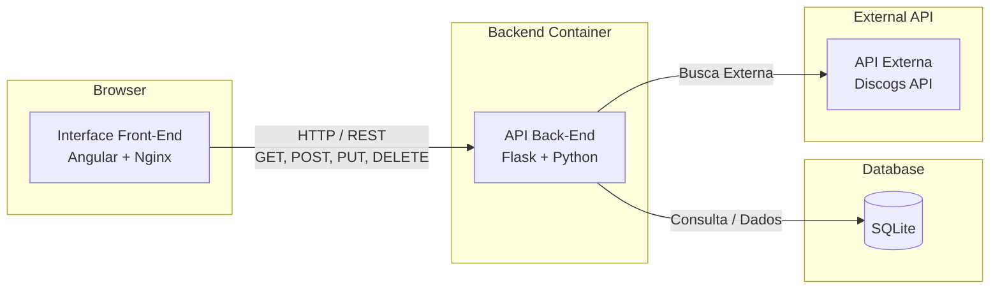

# My Vinyls - Frontend

Aplicação web desenvolvida em **Angular** (utilizando componentes *standalone* e Angular Material) para servir como interface do gerenciador de coleção de discos de vinil, contando com busca integrada em tempo real via API do Discogs.

## Arquitetura da Aplicação (Cenário 1.1)



## Funcionalidades

- **Gerenciamento Visual**: Listagem completa dos vinis cadastrados com suporte a filtros e paginação.
- **Formulário Inteligente**: Modal de cadastro/edição com autocomplete integrado para busca de álbuns na base externa do Discogs.
- **Diálogos de Confirmação**: Componentes modais customizados para remoção segura de itens.
- **Design Moderno**: Estilização baseada em Angular Material com tema personalizado.

---

## Tecnologias Utilizadas

- Angular (Standalone Components)
- Angular Material
- TypeScript & RxJS
- Docker & Nginx (para produção)

---

## Pré-requisitos

- Node.js (versão compatível com Angular moderno)
- npm ou yarn
- Docker (opcional, para empacotamento em container)

---

## Configuração e Execução Local

1. Clone o repositório e navegue até a pasta do frontend:

```bash
cd my-vinyls-frontend

2. Instale as dependências do projeto:
```bash
   npm install
```

3. Inicie o servidor de desenvolvimento local:
```bash
    ng serve
```

4. Build de Teste com docker:

```bash
    ng build
```

5. Como construir e rodar o container do frontend (docker):

```bash
   docker build -t my-vinyls-frontend .
   docker run -d -p 8080:80 --name vinyl-frontend-container my-vinyls-frontend
```

6. Comandos Úteis do Angular CLI

### Desenvolvimento Local
```bash
ng serve
```

### Geração de Componentes
```bash
ng generate component component-name
```
*(Nota: Lembre-se de seguir o padrão oficial de nomenclatura de componentes ex: `vinyl-modal.component.ts`)*

### Execução de Testes Unitários
```bash
ng test
```

## API Externa (Discogs API)

Este projeto consome a [Discogs API Oficial](https://www.discogs.com/developers) para enriquecer o sistema com dados reais de discos de vinil.

- **Documentação Oficial**: [Discogs Developers Documentation](https://www.discogs.com/developers/)
- **Autenticação**: Requer um token de acesso pessoal (gerado gratuitamente em [discogs.com/settings/developers](https://www.discogs.com/settings/developers)), enviado nos headers das requisições.
- **Licença de Uso**: Gratuita para desenvolvimento e uso não comercial, sujeita aos [Termos de Serviço da Discogs](https://www.discogs.com/developers).
- **Método/Rota Utilizado na Aplicação**:
  - `GET /database/search`: Utilizada para realizar a busca e o autocomplete de álbuns e artistas em tempo real, filtrando os resultados por título, artista e formato de vinil.